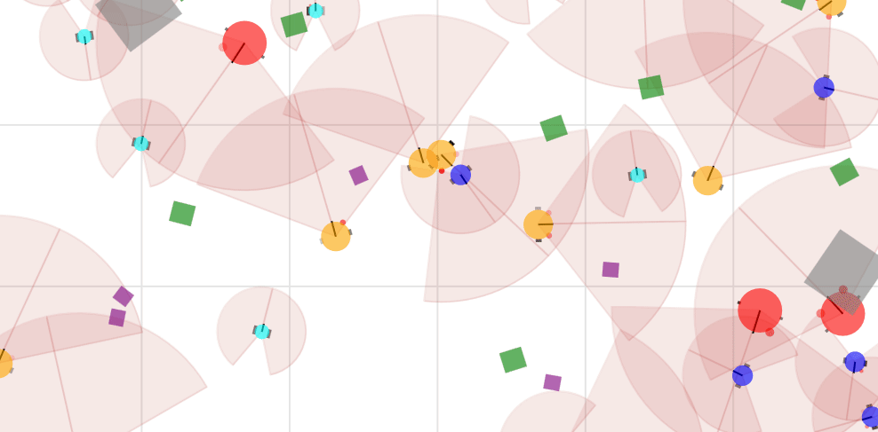

# 🌱 Vivarium

**Vivarium** is a massively multi-agent 2D simulator with realistic physics for research and education in Artificial Intelligence and Artificial Life. It facilitates the design of complex multi-agent ecosystems where thousands of artificial agents interact in a shared environment. The interface is modular, enabling to compose diverse types of agents and entities, each one with its particular dynamics, in a reusable way. It is designed to be usable to a large audience: from high-school students with a code-free web interface, to computer science university students through a pythonic interface enabling real-time interactions, as well to computer science researchers with GPU-accelerated simulation that can run on supercomputers. The core simulator is written in JAX, the web interface with Panel, and the client-server communication relies on gRPC.

### **Key Features**:
- **Predefined and Custom Simulations**: Quickly start with built-in scenes or create your own with customizable parameters.
- **Real-Time Interaction**: Observe and control simulations dynamically using a web interface or programmatically through Jupyter Notebooks.
- **Educational Resources**: Learn multi-agent simulation concepts with a series of interactive educational sessions.



See a preliminary demo of the project on [this video](https://youtu.be/dnO-wo6Ns-8).

## 📥 Installation

1- Clone the repository:

Before following the next instructions, make sure you have Python installed with a version between 3.10 and 3.12. 

```bash
git clone git@github.com:flowersteam/vivarium.git
cd vivarium/
```
2- (Optional) Create and activate a virtual environment:

```bash
python -m venv env_vivarium
source env_vivarium/bin/activate #(for Linux users)
env_vivarium\Scripts\Activate.ps1 #(for Windows users)
```

3- Install the dependencies:

```bash
pip install -e . 
```
<!-- TODO: Also document extra from setup.py -->

If you are a UPF student, continue from [here](notebooks/sessions/README.md).

## 🚀 Usage

Vivarium can be used in three main ways:  
1. **Run a simulation server.**  
2. **Interact with the simulation via a web interface.**  
3. **Control the simulation programmatically in Jupyter Notebooks.**


### 1. Run the simulation in a server 🖥️

To run the simulation in a server, use the following command:

```bash
python3 scripts/run_server.py scene=<SCENE_NAME>
```

The available scenes are located in the `conf/scene` directory as YAML files. It is possible to create custom scene files to define the initial parameters of your simulations with [Hydra](https://hydra.cc/docs/intro/).

#### Using custom scene files 🌄

You can customize the initial simulation parameters by creating your own scene files in YAML format and placing them in this `conf/scene` directory. Scene files can specify parameters such as the number of objects, their size, or the colors, positions, and behaviors of agents for example. 
<!-- TODO: Add documentation on how to write custom scene files -->

To use a custom scene file in your simulation, pass the `scene` option followed by the name of the scene file (without the `.yaml` extension) to the `run_server.py` script. For example, to run the `particle_lenia` scene, use the following command:

```bash
python3 scripts/run_server.py scene=particle_lenia
```

### 2. Interact via the web interface 🌐

You can start the web interface with:

```bash
python3 scripts/run_interface.py
```

It will open a new tab in your browser, where you will be able to select the scene to open. From here, you can observe and interact with the simulation. We recommend starting with the [Web Interface Tutorial](notebooks/tutorials/web_interface_tutorial.md) to get a better understanding of the interface and its functionalities.


### 3. Control simulations from Jupyter Notebooks 📓

You can control the simulator programmatically using Jupyter Notebooks. This allows you to manage agent behaviors, internal states, and environmental dynamics (e.g., spawning resources or interaction mechanisms) using a pythonic interface hiding the complexity of JAX. There are several ways to connect a Jupyter Notebook with a simulation server:

- Creating an instance of `VivariumController` within a notebook, from which you can either connect to an existing server or start a new one and the interface.
- Using the Notebook tab in the web interface, from which you can open a notebook that appears directly within the interface.

## 📚 Tutorials

To help you get started and explore the project, we provide a set of Jupyter notebook tutorials located in the `notebooks/tutorials` [directory](notebooks/tutorials/README.md). These tutorials cover various aspects of the project, from using the graphical interface to interacting with simulations and understanding the backend.

<!-- TODO: List available tutorials here when they will be ready -->


## 🎓 Educational sessions 

We offer a series of educational Jupyter Notebooks designed to teach the fundamentals of multi-agent simulations. These six sessions range from assigning basic agent behaviors to building complex eco-evolutionary environments and logging data for advanced projects. The educational sessions are prefixed by "Session:" in the scene selection page of the interface. After opening a session scene in the interface, you can start the associated notebook directly from there.

Otherwise, you can find the notebook sessions in the `notebooks/sessions` [directory](notebooks/sessions/README.md). They cover topics such as:
- **Assigning reactive behaviors to multiple agents**
- **Controlling the environmental dynamics**
- **Logging and analyzing simulation data**

## 🛠 Development

### gRPC Configuration 🔄

The project uses gRPC to communicate between server and clients. If you made any changes in the `simulator/grpc_server/protos/simulator.proto` file, you will need to recompile the gRPC files. Here is the command line instruction to do so:

```bash
python -m grpc_tools.protoc -I./vivarium/simulator/grpc_server/protos --python_out=./vivarium/simulator/grpc_server/ --pyi_out=./vivarium/simulator/grpc_server/ --grpc_python_out=./vivarium/simulator/grpc_server/ ./vivarium/simulator/grpc_server/protos/simulator.proto
```

### Running Automated Tests 🧪 

If you want to add tests for your local changes, you can write them in the `tests/` directory. Make sure that the name or your files and test functions start with "test". You can then run the following command in the root of the directory to launch them :

```bash
pytest
```

## Acknowledgments

The main contributors of this repository are Clément Moulin-Frier and Corentin Léger from the Flowers team at Inria, with participation of Martial Marzloff. CMF initiated the code base architecture in 2023, CL was the main developer in 2024 with the help of MM, and CMF took over from 2025. CL was funded by the [French National Research Agency](https://anr.fr/), project ECOCURL, Grant ANR-20-CE23-0006. 
