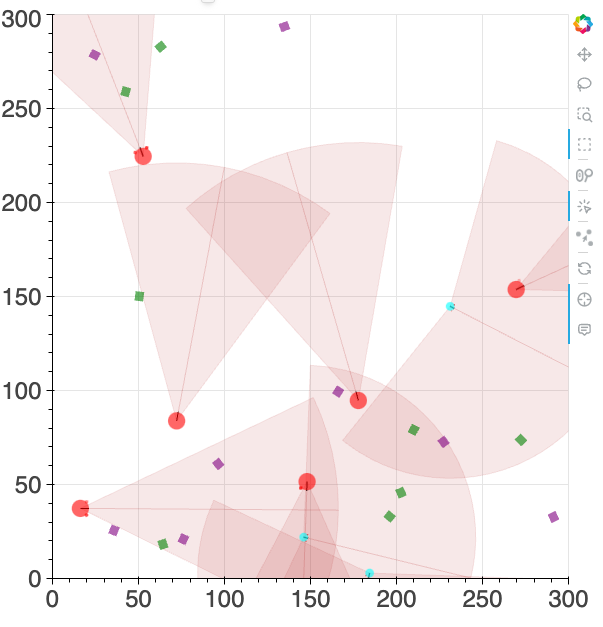

# Introduction to custom scenes creation (simple version for students)

A scene is a [YAML](https://fr.wikipedia.org/wiki/YAML) file that contains the initial parameters of the simulation. It can be used to customize the simulation by specifying the number of agents, their size, their colors etc. The scene files are located in the `conf/scene` directory of the repository.

If you need to create and use a custom scene, you will have to create a YAML file (e.g ```my_custom_scene.yaml```) in the `conf/scene` directory and pass its name when you call the `start_server_and_interface` function in your jupyter notebook:

```python
start_server_and_interface(scene_name="my_custom_scene")
```

## Scene file structure

To understand how to specify a scene, let'slook at a simple example: 

```yaml
# Entity data definitions
entities_data:
  EntitySubTypes:
    - robots
    - obstacles

  Entities:
    robots:
      type: AGENT
      num: 5
      color: blue
      
    obstacles:
      type: OBJECT
      num: 5
      color: red
```

This scene will produce this initial simulation :


## Scene file basic attributes

The scene file above introduces the following concepts:

- `entities_data`: Contains the data of the entities in the simulation.
    - `EntitySubTypes`: Specify the subtypes of entities in the simulation. In this simple scene there are only two entity subtypes: `robots` and `obstacles`.
    - `Entities`: Contains the data of each entity subtype. For each of them we specify: 
        - `type`: The type of the entity. In Vivarium there are two types of entities: `AGENT` or `OBJECT` (see below). 
        - `num`: The number of entities of this subtype.
        - `color`: The color of the entities.

So in this simple scene file, we configure a scene with:

- Five blue agents, whose subtypes are `robots`.
- Five red objects, whose subtypes are `obstacles`.

As seen in Session 3, subtype labels are arbitrary (you can choose whatever name you want in the scene file: here we chose `robots` and `obstacles`) and are used for selectively sensing specific entities. For instance, if you want an agent to sense only the `obstacles` (i.e. red object), you will write in your Jupyter Notbook something like:

```python
left, right = agent.sensors(sensed_entities=["obstacles"])
```

 On the other hand, entity types are predefined in Vivarium: an entity is either of type `AGENT` or `OBJECT`. Entities with type `AGENT` are represented as circles in the interface, they are equipped with sensors and motors and we can attach behaviors to them. Entities with type `OBJECT` are represented as squares in the interface and we cannot attach behaviors to them. See also the [web interface tutorial](https://github.com/flowersteam/vivarium/blob/main/notebooks/tutorials/web_interface_tutorial.md).

 The definition of entity subtypes, i.e. the list of arbitrary subtypes below `EntitySubTypes` has to be in the following order: first agent's subtype, then object subtypes. Since in this simple scene we only have one subtype per entity type, we first indicate `robots`, then `obstacles`.

Note that the initial positions and orientations of entities are not specified in the scene file. Instead, they will be set randomly at the start of the simulation. If you need to configure intitial positions and orientations, you can do it directly in the jupyter notebook using the `x_position`, `y_position` and `orientation` attributes of any entity, e.g. `agent_0.x_position = 25`. Note that two entities cannot be positioned at the exact same place in the scene. 

## A more complex scene

Let's now create a more complex scene. We here consider 2 types of agents and 2 types of objects, in a larger scene. We will also have a variable number of entites, allowing to add or remove some of them during the simulation.

```yaml
box_size: 300 # Make the size of the scene 300x300 units (by default it was 100x100)

# Entity data definitions
entities_data:
  EntitySubTypes: # We define 4 entity subtypes 
    - PREDATORS
    - PREYS
    - RESOURCES
    - POISON

  Entities:
    PREDATORS: # Set attributes of subtype PREDATORS
      type: AGENT # Predators are agents, i.e. they have sensors and motors and we can attach behaviors to them
      num: 10 # There can be at most 10 predator agents in this scene
      existing: 6 # But only 6 of the 10 predator agents are initially present
      color: red # Predator agents are red
      diameter: 10.0 # Their diameter is 10
      prox_dist_max: 150 # Their sensor can detect other entities at a distance of 150 (i.e. half of the map size)
      prox_cos_min: 0.90 # Their field of view is narrow

    # Add preys entity
    PREYS: # Set attributes of subtype PREYS
      type: AGENT # PREYS are also agents
      num: 5 # There can be at most 5 prey agents in this scene
      existing: 3 # But only 4 of the 10 prey agents are initially present
      color: cyan # Prey agents are cyan
      diameter: 5.0 # Their diameter is 5
      prox_dist_max: 100 # Their sensor can detect other entities at a distance of 100 (i.e. less than the predator)
      prox_cos_min: -0.20 # Their field of view is larger than predator agents (see last section of Session 3)
    
    # Add ressource entity
    RESOURCES: # Set attributes of subtype RESOURCES
      type: OBJECT # Resources are objects
      num: 8 # There are 8 resources. Since we don't specify the `existing` parameter, the 8 resources will be initially present
      color: green # Resources are green

    # Add poison entity
    POISON: # Set attributes of subtype POISON
      type: OBJECT # POISON are objects
      num: 8 # There are 8 poison objects 
      color: purple # They are purple
``` 

Here we defined 2 subtypes of agents (`PREDATORS` and `PREYS`) and 2 subtypes of objects (`RESOURCES` and `POISON`). We give them different colors, sizes, proximeters ranges, and proximeters angles. We also specify there maximum and initial number. 

Here is the render of the scene:



Remind that the definition of entity subtypes, i.e. the list of arbitrary subtypes below `EntitySubTypes` has to be in the following order: first agent's subtypes, then object subtypes. Therefore, in this more complex scene, we first define `PREDATORS` and `PREYS` (whose type is `AGENT`), then `RESOURCES` and `POISON` (whose type is `OBJECT`).

In Vivarium, we can set the maximum number of entities of a given subtype with the `num` parameter, as well as the actual number initially present in the scene with the `existing` parameter. As you can see in the scene rendering above, the number of each entity subtype correspond to the one specified in the `existing` parameter of the scene file. If `existing` in not specified, the initial number will be the maximum number defined in `num`. In the Jupyter Notebook, we can add or remove an entity by modifying its `exists` attribute of any entity. For instance:

```python
agent = controller.agents[-1]  # Select the last agent of the list
agent.exists = True  # Make this agent appear in the scene
agent.exists = False  # Make this agent disappear in the scene
```

You can use such scene files to configure the scene(s) of your mini-project. For example, you can copy the scene definition above in a file named `my_custom_scene.yaml` in the `conf/scene` directory of the repository. Then, in a Jupyter Notebook, you can load that scene with:


```python
# First import the necessary functions as shown at the beginning of each session.

start_server_and_interface(scene_name="my_custom_scene")
```

You can then try to modify some parameters of the scene file, close the server and interface with the command provided at the end of each session, and reopen it as above to observe the effects of your changes. 

 If you have doubt about how to deal with scene files in the context of your mini-project, ask a professor and we will help you configuring it.