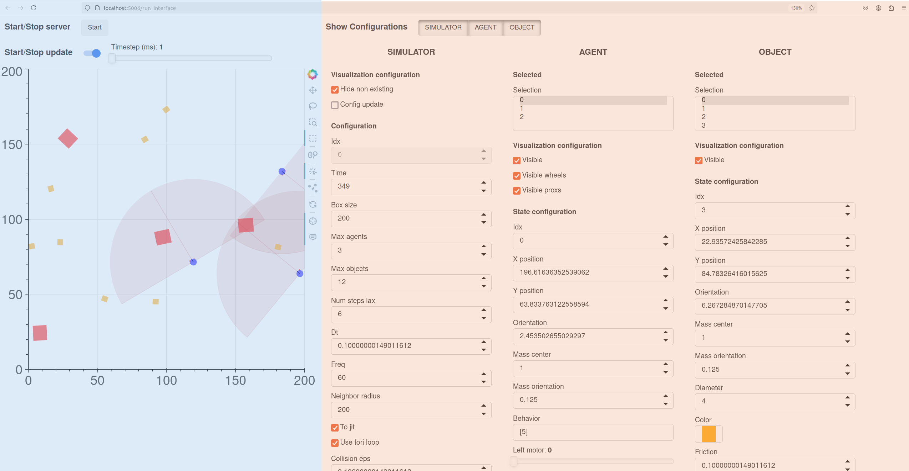
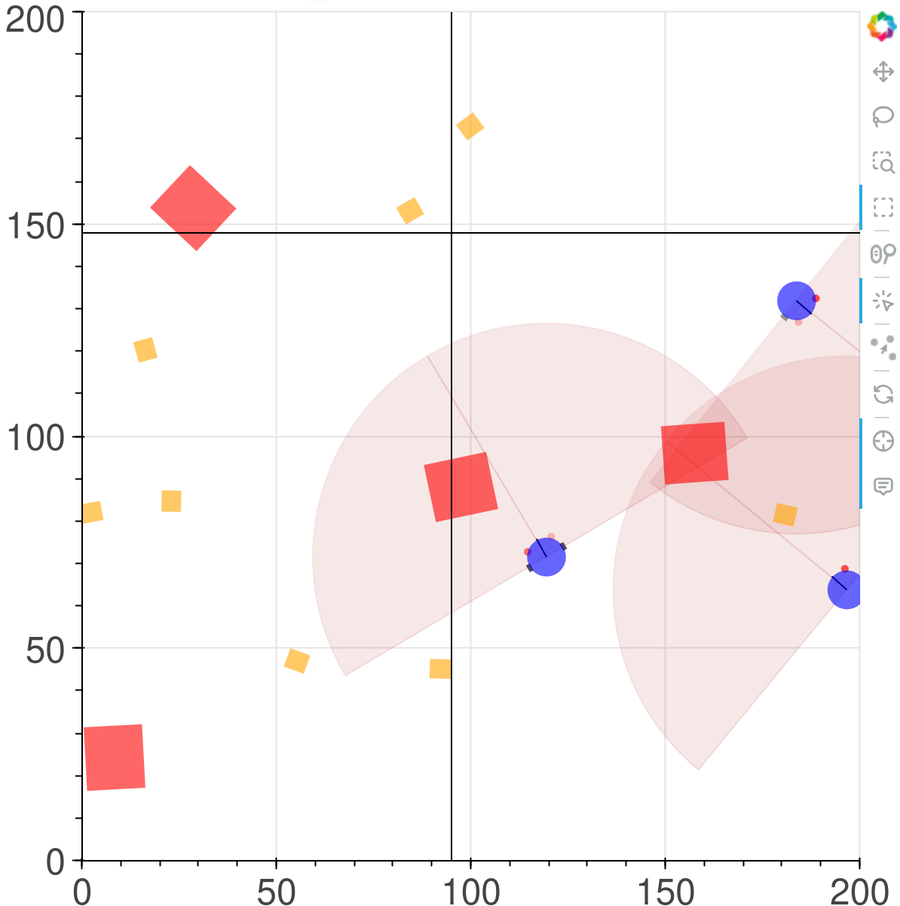
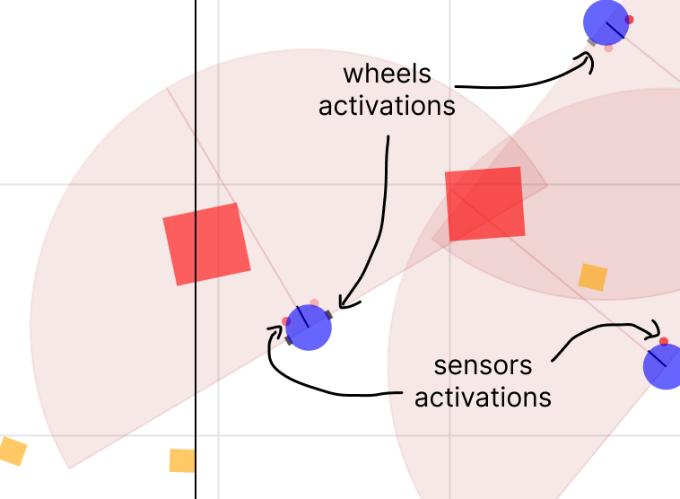

**Note**: If you see this file in pure text (i.e. no images), right-click on the text and activate "Show Markdown Preview".

# Introduction to the web interface

The web interface enables you visualize and interact with the simulation in real-time. It is built using the Bokeh library, which allows for interactive plots in Python. The interface is accessible through a web browser, and can be used to modify the simulation parameters, visualize the agents and objects, and start/stop the simulation.

The web interface has two main components:
- The simulation plot on the left (in blue)
- The configurations on the right (in red)

## Simulation plot

Here is an example of a frame of a simulation plot with the web interface:

We can see the agents (squares) and objects (circles) on the map. The agents have a front direction as indicated by the radius line on the shaded semi-circle in front on them. This area represents its field of view. More specifically, the agents are simple robots with two wheels and two proximity sensors, similar to [Braitenberg Vehicles](https://en.wikipedia.org/wiki/Braitenberg_vehicle). The sensors activations are represented by little red points at the front of the agents : the higher the activations are (when an object is close), the brighter the red points are. There is a similar mechanism for wheels activations, they are displayed as little rectangles on the side of the agents. The higher the activation of the wheels, the darker the rectangles are.
In order to move in its environment, an agent has to activate its wheels. Here is a detailed view of this on the interface:

The map is a torus, meaning that an entity moving further than a map boundary will appear on the other side of the map. For instance, if the environment is a square of size 100, an agent positioned at coordinate 99 on the x-axis and moving two units to the right will end up at coordinate 1 on the x-axis.

From top to bottom can be found:

- **The start/stop button for the simulator**, to start or stop the simulation. Currently, it is recommended to stop the simulation when modifying parameters on the interface (how to modify them is explained below).
- **The refresh rate of the interface (Plot FPS)**, which specifies how many frames per seconds are displayed in the simulating plot.
- **The "Start Drag & Drop" button** enables to move entities (agents or objects) by dragging and dropping them in the simulation plot. For this you first have to click on this button, then to drag and drop some entities in the simulator plot, then click the button again to complete the operation.
- **The simulation plot**, with the agents (squares) and objects (circles); on the right are some tools that can be used to select these entities (see the [Bokeh documentation](https://docs.bokeh.org/en/latest/docs/user_guide/interaction/tools.html#ug-interaction-tools-pandrag) for more information). The most useful tools are:
    - The `Tap` tool, to select an entity by clicking on it;
    - The `Lasso/Box select` , to easily select multiple entities at once;
    - The `Point Draw Tool` , that can be used to move the entities by dragging them around the plot (see above for how to drag and drop entities);
    - The `Reset` tool , which sets back the plot to its original position if it has been moved around too much.

## Configurations

<!-- TODO: add a tutorial on what each attribute does -->
The configurations can be used to modify the agents, objects, or simulator attributes.
<!-- To show one configuration tab, click on the appropriate **Show Configurations** toggle. -->

### Simulator configurations
This configuration tab shows the simulator attributes. Please refer to the documentation for further details on what each configuration does.

### Entity configurations
An *entity* refers to a physical entity in the simulator, e.g. an agent or an object.

From top to bottom can be found:
- **The selected list**, which indicates which entities are currently selected, either by selecting them on the plot (using the `Tap` tool) or directly in this list.

    The selected entities are the ones that will be affected by the next points.

  
    When an entity is selected, its attributes will be shown in the `Configurations` below. However, if multiple entities are selected at the same time (with the shift key for example), only the first selected entity will have its attributes shown below, but the modifications made on those attributes will apply for *all of the selected entities*.
<!-- 
- **The visualization configurations**, which are used to select what is visible on the plot; checking or unchecking these boxes will make the appropriate element appear / disappear from the plot. Agents are simple robots with two wheels and two proximity sensors (as explained above), which can be visualized or not by toggling the associated checkboxes.
- **The state configurations**, which manages all the attributes of the agents / objects; for more details on what each configuration does, please refer to the documentation
-->

For instance, try to set the `Left motor` parameter to 1. Make sure that the simulator is started (see above) and that the `Behavior` at the bottom of the column is set to  `MANUAL`. This will activate the left wheel at full speed and you should see the agent spinning on itself.

You can try modifying other agent's attributes and observe their effect in the simulation plot. 

<!-- TODO: replace this old part with a new one enabling to control the simulation from the interface for example -->
<!-- 
## Example case

Now to try and use the interface, we can start with a simple scenario with predators and preys. We will have big predators and small fast preys.

### Setup

Before modifying the attributes, stop the server with the **Start/Stop server** button.

1. First, select a few agents either with the **Selected** list or by selecting them on the plot.
2. Now search for `Behavior` attribute in the **AgentConfig** part, click on the dropdown menu and select `FEAR`. Agents with a `FEAR` behavior will move away from others.
3. Find the `Diameter` attribute and reduce it, to 3 for example. You can directly observe the change of size on the selected agents in the simulator plot.
4. Set the `Speed mul` value to 2. This will make the selected agents move twice faster as the other (i.e. preys will move faster than predators).
5. Go down to find the `Color` attribute and set a color that you think fits the `FEAR` behavior, such as blue or green.
6. Repeat steps 1-5 with the other agents, give them the `AGGRESSION` behavior, increase their size, make them slower than the preys and a different color. `AGGRESSION` makes the agents go to the nearest entity they can see.

If you stopped the server, you can start it again, and you should see the predators following the preys, while the preys avoid the other agents! -->